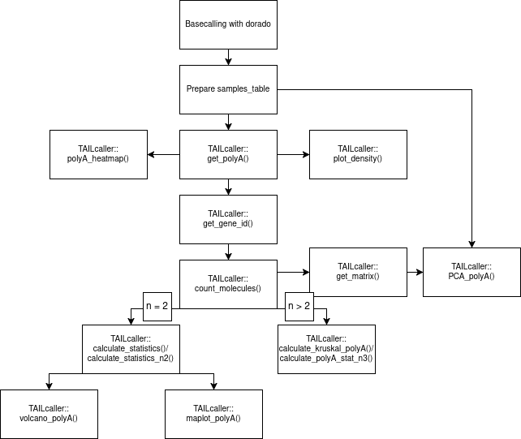
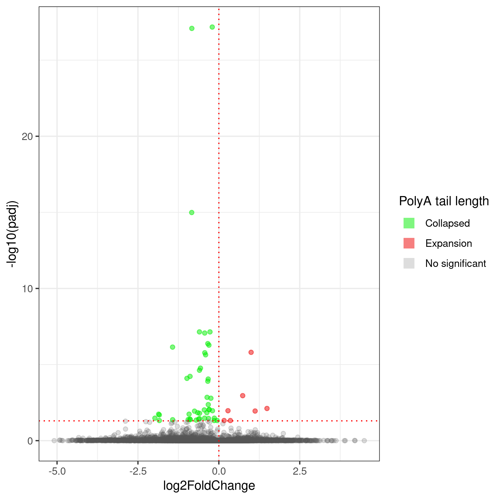
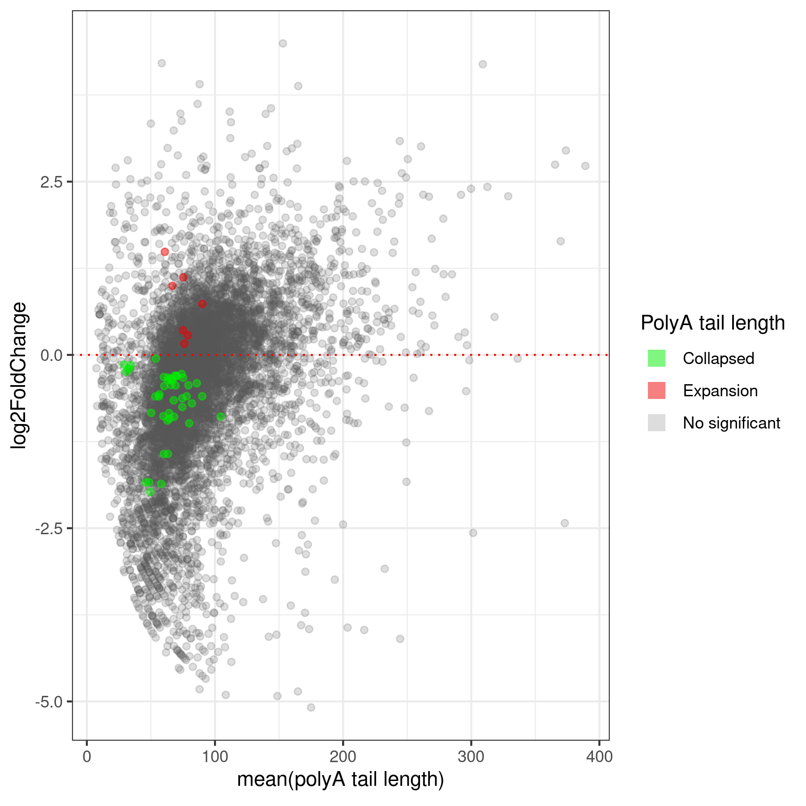
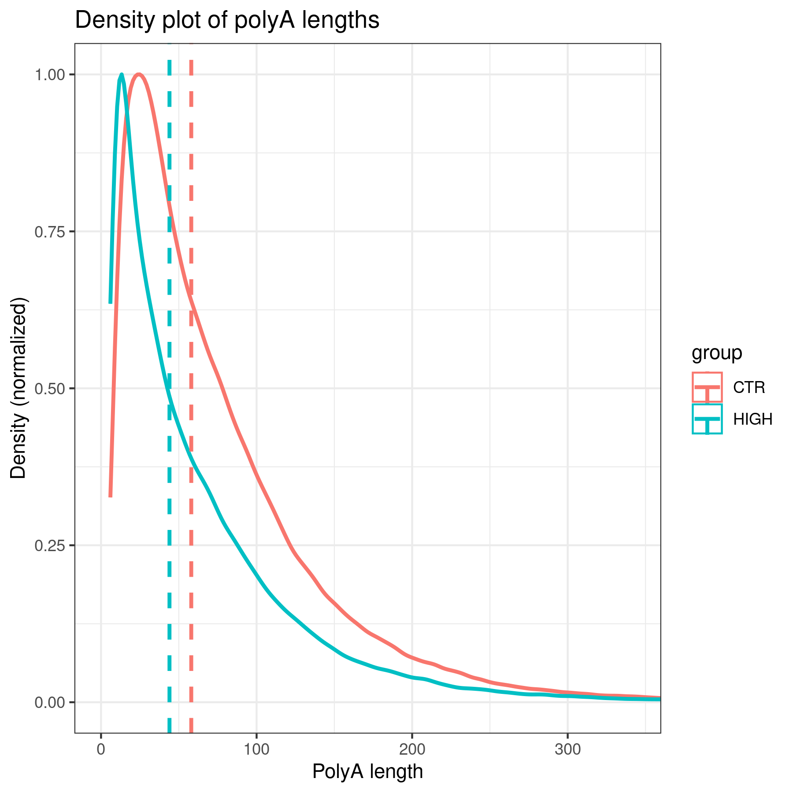
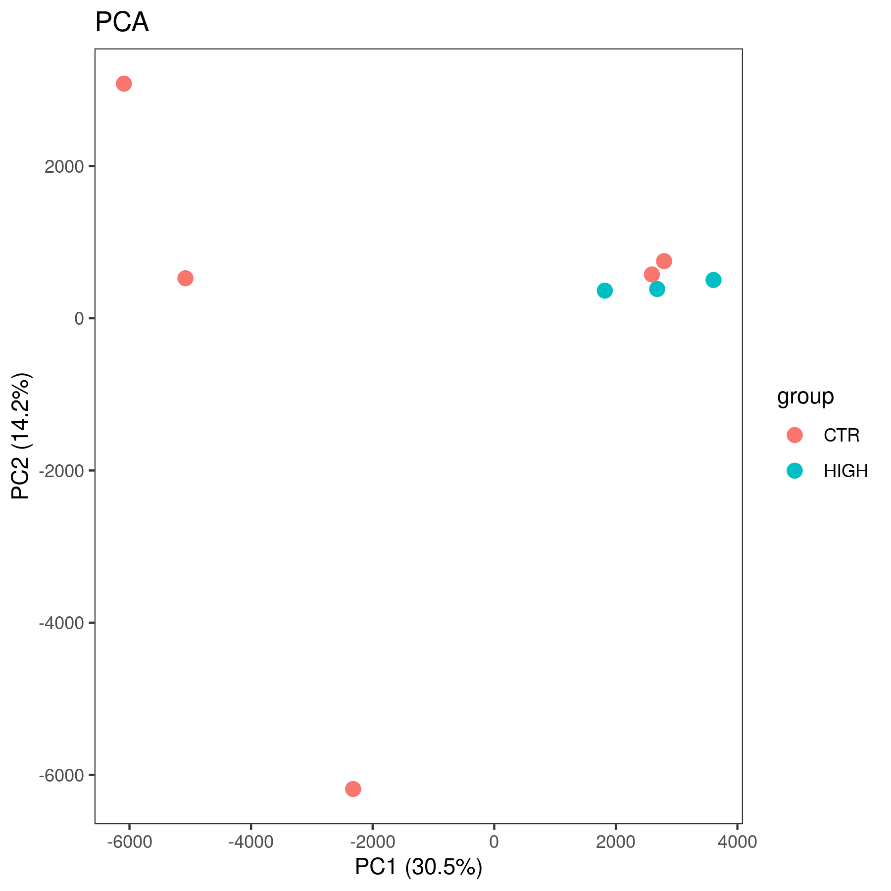
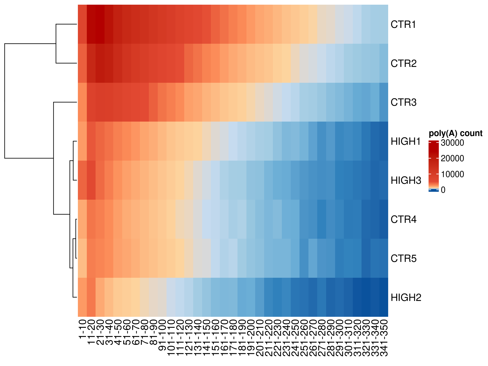
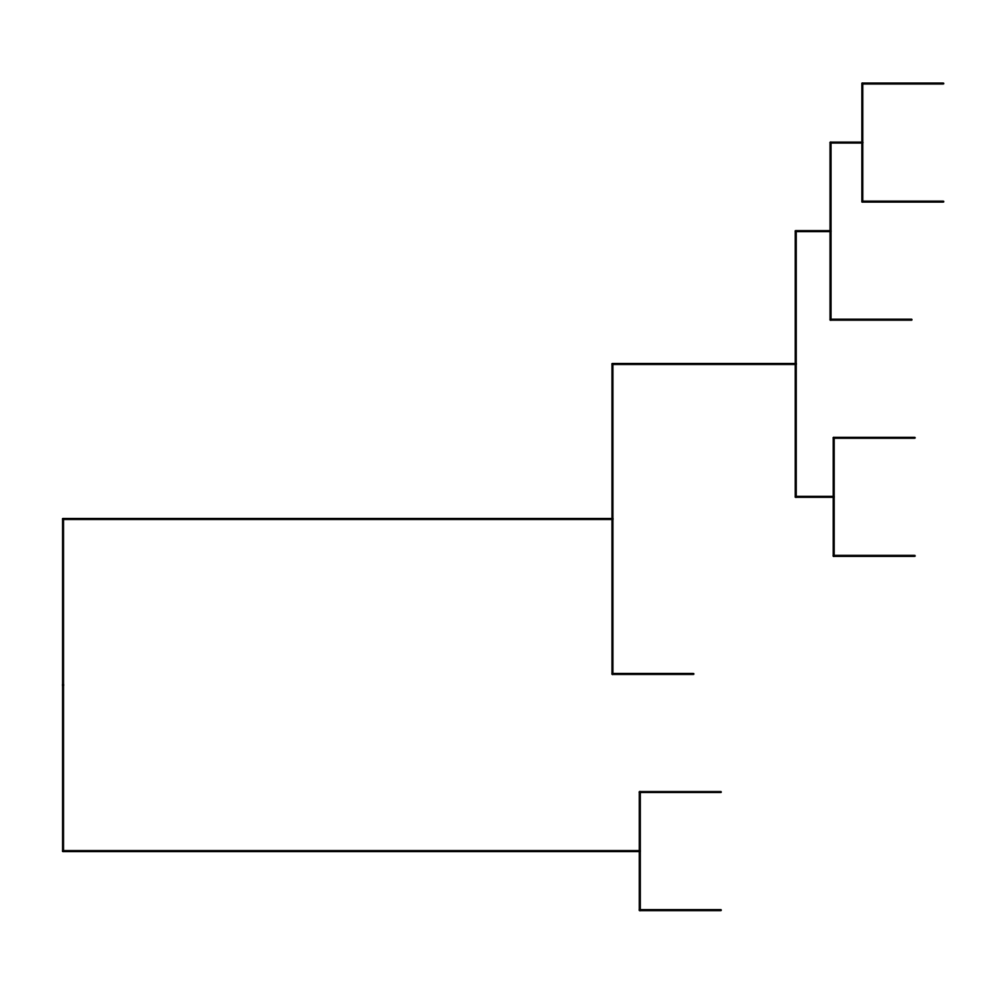

# TAILcaller

<!-- badges: start -->


[](https://doi.org/10.5281/zenodo.15056929)


<!-- badges: end -->

R package for analyzing polyA tails after dorado basecalling. Dorado allows polyA estimation. 

test_data = https://doi.org/10.6084/m9.figshare.28632515.v1




The command to perform basecalling for TAILcaller to work correctly.
```r
~/dorado-0.8.1-linux-x64/bin/dorado basecaller sup --reference transcriptome.fasta --estimate-poly-a pod5s/ > CONTROL.bam
```

# Installation

```r
install.packages("devtools")
library(devtools)
devtools::install_github('Mordziarz/TAILcaller')
library(TAILcaller)
```
To use all features of the program, you will need several libraries.

```r
library(Rsamtools)
library(dplyr)
library(stats)
library(tidyr)
library(rlang)
library(ggplot2)
library(ComplexHeatmap)
library(ggtree)
library(circlize)
```

# set.seed() for reproducible results

```r
set.seed(123)
```

# Input data and get_polyA() function

The get_polyA() function is the main function of the package, which extracts polyA tail information from a BAM file.

```r
bamfile1 <- "path/to/bam"
bamfile2 <- "path/to/bam"
bamfile3 <- "path/to/bam"
bamfile4 <- "path/to/bam"
bamfile5 <- "path/to/bam"
bamfile6 <- "path/to/bam"
bamfile7 <- "path/to/bam"
bamfile8 <- "path/to/bam"

samples_table <- data.frame(bam_path = c(bamfile1,bamfile2,bamfile3,bamfile4,bamfile5,bamfile6,bamfile7,bamfile8),
                            sample_name = c("condition1.1","condition1.2","condition1.3","condition1.4","condition2.1","condition2.2","condition2.3","condition2.4"),
                            group = c("condition1","condition1","condition1","condition1","condition2","condition2","condition2","condition2"))


get_polyA_out <- TAILcaller::get_polyA(samples_table = samples_table)

```

# Linking transcripts to genes

The get_gene_id function links transcripts to genes, which is useful for performing significance analysis at the transcript or gene level.

Please ensure the uniqueness of the transcript_id names to avoid duplicating results, and make sure to retain two columns: one with gene_id and the other with transcript_id.

```r
library(rtracklayer)

gtf <- import.gff("path/to/gtf/file")
gtf <- as.data.frame(gtf)

```

```r
get_gene_id_out <- TAILcaller::get_gene_id(polyA_table=get_polyA_out,
                                            gtf_file = gtf,
                                            transcript_column_gtf = "transcript_id",
                                            gene_column_gtf = "gene_id")
```

# Calculation of basic statistics and counting molecules with polyA tails

The count_molecules function allows counting the number of molecules (at the transcript level, which_level = column with transcripts, or at the gene level, which_level = column with genes) in groups (grouping_factor = "group").

```r
count_molecules_out <- TAILcaller::count_molecules(polyA_table = get_gene_id_out,
                                                    grouping_factor="group",
                                                    which_level="transcript_id")
```

# Calculation of statistics

The calculate_statistics function performs the Wilcoxon test, p-value adjustment (FDR), Cohen's d test, and log2 fold change calculation. The function requires a table with polyA tail values. It is possible to calculate statistics for genes if you define polyA_table as the output table from the get_gene_id function. The grouping factor is the column that distinguishes the samples. The which_level argument should be assigned to the column containing transcript or gene identifiers. control_group and treated_group are the names of the groups in "" that correspond to those in the grouping_factor column (defined earlier).

```r
TAILcaller::calculate_statistics(polyA_table = get_gene_id_out,grouping_factor = "group",which_level = "gene_id",control_group = "condition1",treated_group = "condition2")
```

For n > 2, the calculate_kruskal_polyA() function has been prepared.

```r
TAILcaller::calculate_kruskal_polyA(polyA_table = get_gene_id_out,grouping_factor = "sample_name",which_level = "gene_id")
```

# Volcano plot

TAILcaller allows the user to create a volcano plot.

```r
TAILcaller::volcano_polyA(calculate_statistics_out = calculate_statistics_out,
                            collapsed_color = "green",
                            expansion_color = "red")
```



# MAplot

TAILcaller allows the user to create a MA plot.

```r
TAILcaller::maplot_polyA(calculate_statistics_out = calculate_statistics_out)
```



# Density plot 

TAILcaller allows the user to create a density plot. The user can choose whether to display the median (stats = "median") or the mean (stats = "mean"). The density_plot function executes a global Wilcoxon statistical test for n = 2 and a Kruskal-Wallis test for n > 2.

```r
TAILcaller::plot_density(polyA_table = polyA_table,stats = "mean",grouping_column = "group")
```



# Matrix

The user can create a matrix based on the table from the count_molecules function. The statistics can be "count" (expression), "avg_polyA_length" (mean), or "median_polyA_length" (median).
If the user wants to count values for transcripts (which_level="transcript_id"), they should specify this. If counting for genes, they should use which_level="gene_id".

```r
count_molecules_out <- TAILcaller::count_molecules(polyA_table = get_gene_id_out,grouping_factor="sample_name",which_level="gene_id")

TAILcaller::get_matrix(count_molecules_out = count_molecules_out,grouping_factor = "sample_name",which_level = "gene_id",statistic = "median_polyA_length")
```
# PCA

The user can perform PCA based on the output from the get_matrix() function.

```r
TAILcaller::PCA_polyA(get_matrix_out = get_matrix_out,samples_table = samples_table,grouping_factor = "group")
```



# Heatmap 

The user can generate a heatmap based on an interval matrix (select = "base") or a normalized matrix (based on percentages, select = "normalized"), which are created within the polyA_heatmap function. Additionally, it is possible to perform clustering (phylogenetic tree) based on the heatmap.

heatmap_color: Please select one of the following valid palettes: "red_green", "green_red", "blue_green", "green_blue", "blue_red", or "red_blue".

```r
polyA_heatmap_out <- TAILcaller::polyA_heatmap(polyA_table = get_polyA_out,
                                    grouping_factor = "sample_name",
                                    frame = 10,
                                    select="base",
                                    heatmap_color ="green_red")

polyA_heatmap_out$matrix
```

```r
polyA_heatmap_out$heatmap
```



```r
polyA_heatmap_out$tree
```

